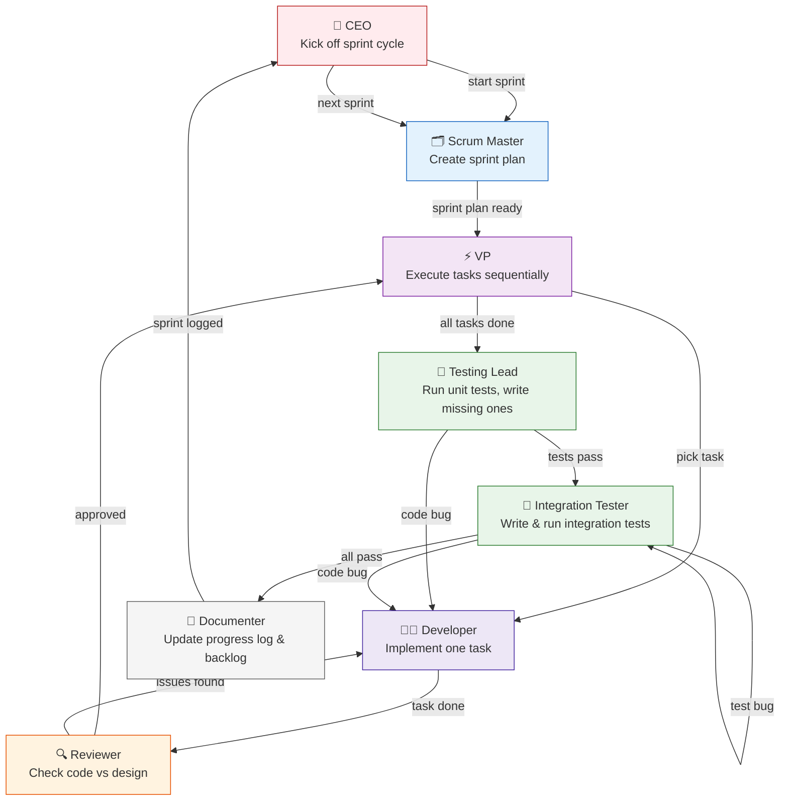

# Strata v2 — Technical Design

Strata is an offline-first, reactive data framework for TypeScript/JavaScript. It handles entity storage, multi-device sync via cloud blob storage, HLC-based conflict resolution, multi-tenancy, and reactive UI bindings.

## Design Documents

| Document | Description |
|---|---|
| [Architecture Overview](docs/architecture.md) | High-level component diagram, design principles, data flow summary |
| [Schema & Repository](docs/schema-repository.md) | Entity definitions, ID generation, key strategies, repository API surface |
| [Adapter Contract](docs/adapter.md) | `BlobAdapter` interface, `cloudMeta` per-call, transform pipeline |
| [Tenant System](docs/tenant.md) | Multi-tenancy, `cloudMeta`, tenant lifecycle, sharing, tenant list storage |
| [Persistence & Sync](docs/persistence-sync.md) | Serialization, hashing, flush timing, sync phases, conflict resolution, tombstones |
| [Reactive Layer](docs/reactive.md) | Event bus, shared subjects, observables, change detection, batch writes |
| [App Lifecycle](docs/lifecycle.md) | Full lifecycle sequence diagram (init → tenant → query → save → sync → dispose) |
| [Decisions Tracker](docs/decisions.md) | All accepted, rejected, and future decisions with rationale |

## Key Design Choices

- **In-memory Map is source of truth** — all reads are sync. Adapters are persistence only.
- **One `BlobAdapter` interface** — 4 methods, same for local and cloud. No query delegation.
- **One `Subject<void>` per entity type** — all observers pipe off it with `distinctUntilChanged`.
- **Three-phase sync** — hydrate on load, periodic persist, manual full sync. One sync at a time globally.
- **`cloudMeta` per-call** — adapters receive opaque tenant location info. No generics. No tenant type pollution.
- **JSON with type markers** — `Date` wrapped as `{ __t: 'D', v: iso }`. No sorted keys needed.
- **ID+HLC partition hash** — FNV-1a. No blob content hashing. Catches cross-device version collisions.

## Status

React bindings design is pending. All other components have finalized designs.

