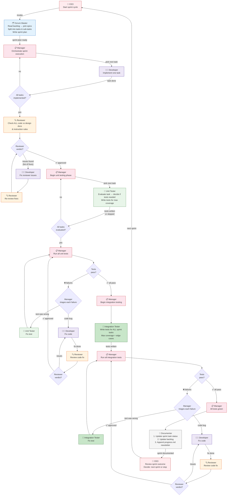
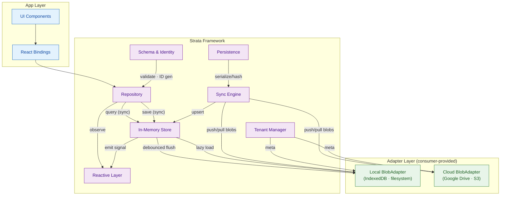

# Strata v2 — Architecture Overview

## Design Principles

1. **The partition is the unit of sync. The entity is the unit of query.** Partitions exist for efficient blob transfer. Queries run in-memory.
2. **In-memory store is the source of truth for reads.** All queries run against Map. Adapters are persistence only.
3. **Writes are instant.** Sync to Map, async flush to adapter. No loaders needed for saves.
4. **Reactive is event-driven.** One Subject per entity type. Mutation → Map scan → emit if changed. No adapter I/O in reactive path.
5. **One adapter interface.** `BlobAdapter` for both local and cloud — 4 methods, blob I/O only. Framework handles serialization.
6. **No generics in app code.** Zero angle brackets. Types inferred from entity definitions.
7. **Offline-first.** Local is always available. Cloud sync is best-effort. Load never fails due to cloud.

## High-Level Component Architecture





## Components

| Component | Responsibility | Details |
|---|---|---|
| **Repository** | Public CRUD + observe API | Two types: `Repository<T>` and `SingletonRepository<T>`. See [repository & schema](v2-schema-repository.md). |
| **In-Memory Store** | Source of truth for reads | `Map<entityKey, Map<id, entity>>`. Sync writes, lazy partition loading, debounced flush. |
| **Reactive Layer** | Observable data bindings | One `Subject<void>` per entity type. Observers pipe with `distinctUntilChanged`. See [reactive](v2-reactive.md). |
| **Sync Engine** | Bidirectional local↔cloud sync | Three-phase model. HLC conflict resolution. Tombstones. See [persistence & sync](v2-persistence-sync.md). |
| **Persistence** | Serialize/deserialize/hash | JSON with type markers. FNV-1a hash on ID+HLC pairs. Transform pipeline. See [persistence & sync](v2-persistence-sync.md). |
| **Schema & Identity** | Entity definitions, IDs, partitioning | Three key strategies. `deriveId` for computed keys. See [repository & schema](v2-schema-repository.md). |
| **Tenant Manager** | Multi-tenancy lifecycle | `meta`-based. Not a repo. See [tenant](v2-tenant.md). |
| **Adapter** | Blob I/O (local + cloud) | Single `BlobAdapter` interface. 4 methods. See [adapter](v2-adapter.md). |

## Data Flow Summary

```
WRITE:  repo.save(entity) → Map.set [sync] → emit signal [sync] → flush to local [async, debounced 2s]
READ:   repo.query(opts)  → scan Map [sync] → filter/sort/paginate → return
OBSERVE: repo.observe(id) → Subject.pipe(map(() => Map.get(id)), distinctUntilChanged)
SYNC:   memory → local (2s) → cloud (5m) | cloud → local → memory (on load)
```

## Package Structure

```
@strata/core                     → Framework: store, repo, reactive, sync, persistence, schema, tenant
@strata/cloud-explorer           → CloudExplorer UI + ExplorerDataSource interface (future)
@strata/google-drive-adapter     → BlobAdapter + CloudFileService + explorer source (future)
@strata/s3-adapter               → BlobAdapter + CloudObjectService + explorer source (future)
```
