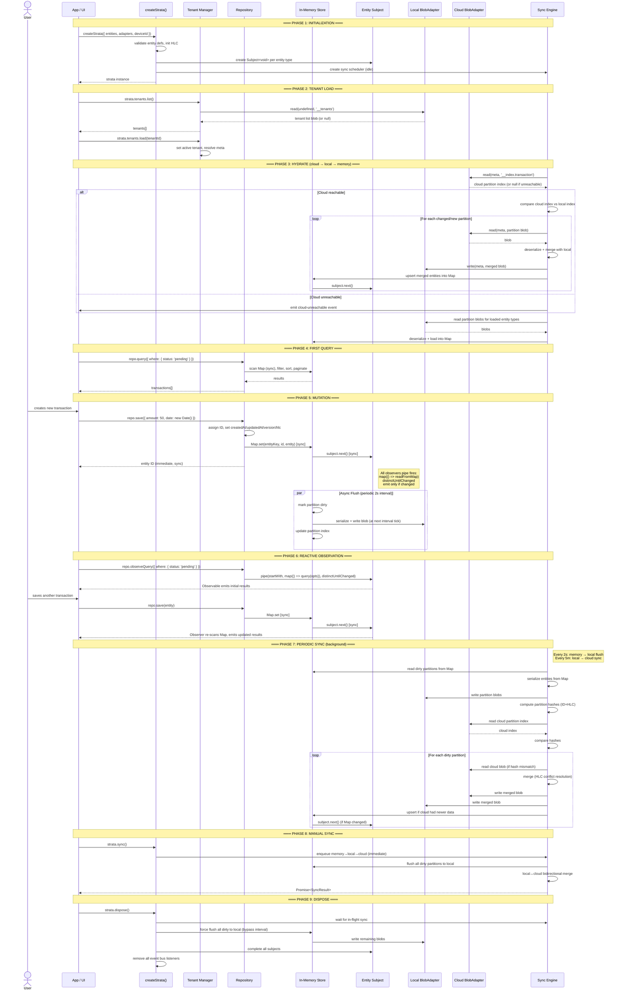

# App Lifecycle & Data Flow

## Lifecycle Sequence



## Phase Summary

| Phase | What happens | Blocking? |
|---|---|---|
| 1. Init | Create strata, validate schemas, init HLC | Sync — instant |
| 2. Tenant | Load tenant list from local, set active | Async — local adapter read |
| 3. Hydrate | Cloud → local → memory. Cloud unreachable = load from local only | Async — adapter I/O |
| 4. First Query | Scan in-memory Map | Sync — instant |
| 5. Mutation | Map.set + emit signal | Sync — instant. Flush is async background. |
| 6. Observe | Pipe off entity subject, re-scan Map on signal | Sync — no adapter I/O |
| 7. Periodic Sync | memory→local (2s), local→cloud (5m) | Async — background, one at a time |
| 8. Manual Sync | memory→local→cloud, immediate | Async — returns Promise |
| 9. Dispose | Wait for sync, flush, complete subjects | Async — waits for completion |

## `StrataConfig`

```typescript
type StrataConfig = {
  readonly appId: string;
  readonly entities: ReadonlyArray<EntityDefinition<any>>;
  readonly localAdapter: BlobAdapter | StorageAdapter;
  readonly cloudAdapter?: BlobAdapter;
  readonly deviceId: string;
  readonly encryption?: { readonly password: string };
  readonly deriveTenantId?: (meta: Record<string, unknown>) => string;
  readonly options?: StrataOptions;
};
```

- **`appId`** — unique app identifier, used for key namespacing in `AdapterBridge`
- **`localAdapter`** — accepts either `BlobAdapter` or `StorageAdapter`. If a `StorageAdapter` is passed, the framework auto-wraps it with `AdapterBridge`.
- **`encryption`** — when provided with a `StorageAdapter`, `createStrataAsync` initializes encryption automatically
- **`deriveTenantId`** — optional function to derive deterministic tenant IDs from `meta`. Useful for sharing (same cloud folder → same tenant ID across users). Adapter packages can ship helpers.

## Sync Events

Subscribe to sync lifecycle events:

```typescript
strata.onSyncEvent((event) => {
  switch (event.type) {
    case 'sync-started': /* ... */ break;
    case 'sync-completed': /* event.result */ break;
    case 'sync-failed': /* event.error */ break;
    case 'cloud-unreachable': /* ... */ break;
  }
});

strata.offSyncEvent(listener);  // unsubscribe
```

## Dirty Tracking

```typescript
// Sync check
if (strata.isDirty) { /* data not yet synced to cloud */ }

// Reactive observable
strata.isDirty$.subscribe((dirty) => {
  showUnsavedIndicator(dirty);
});
```

Tracks whether any data has not yet reached the cloud. Clears after successful cloud sync.

## Encryption Methods

The `Strata` class exposes three methods for managing at-rest encryption. All three require `localAdapter` to be a `StorageAdapter` (not a raw `BlobAdapter`).

```typescript
// Enable encryption on an unencrypted instance.
// Generates DEK + salt, derives KEK, wraps DEK, stores salt + DEK blobs,
// and re-encrypts all existing data blobs via StorageAdapter.
await strata.enableEncryption(password);

// Disable encryption on an encrypted instance.
// Derives KEK, unwraps DEK, decrypts all existing data blobs,
// and removes __strata_salt and __strata_dek blobs.
await strata.disableEncryption(password);

// Change the encryption password.
// Derives old KEK, unwraps DEK, derives new KEK with same salt,
// re-wraps DEK, and overwrites __strata_dek blob.
await strata.changePassword(oldPassword, newPassword);
```

Throws `Error` if `localAdapter` is not a `StorageAdapter`.

## `createStrataAsync` Factory

Async version of `createStrata` that handles `StorageAdapter` wrapping and encryption initialization in one step.

```typescript
const strata = await createStrataAsync({
  appId: 'my-app',
  entities: [taskDef, accountDef],
  localAdapter: myStorageAdapter,   // StorageAdapter (not BlobAdapter)
  cloudAdapter: myCloudAdapter,
  deviceId: 'device-1',
  encryption: { password: 'user-secret' },
});
```

When `localAdapter` is a `StorageAdapter` and `encryption` config is provided, `createStrataAsync`:

1. Calls `initEncryption(storageAdapter, appId, password)` to bootstrap or load the DEK
2. Wraps the `StorageAdapter` with `AdapterBridge`, passing `encryptionTransform(encCtx)` as a transform
3. Constructs the `Strata` instance with the wrapped adapter

If `localAdapter` is a `BlobAdapter` or no `encryption` config is provided, it behaves identically to `createStrata`.
